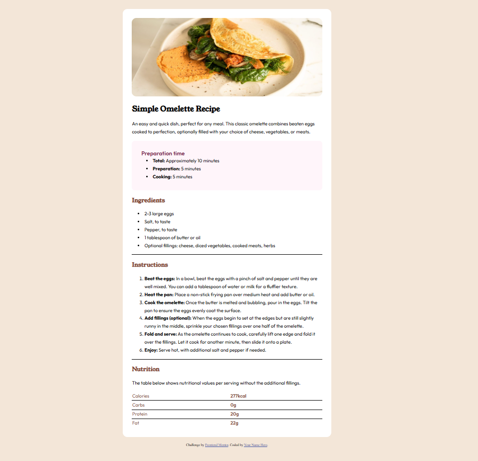

# Frontend Mentor - Recipe page solution

This is a solution to the [Recipe page challenge on Frontend Mentor](https://www.frontendmentor.io/challenges/recipe-page-KiTsR8QQKm). Frontend Mentor challenges help you improve your coding skills by building realistic projects. 

## Table of contents

- [Overview](#overview)
  - [The challenge](#the-challenge)
  - [Screenshot](#screenshot)
  - [Links](#links)
- [My process](#my-process)
  - [Built with](#built-with)
  - [What I learned](#what-i-learned)
  - [Continued development](#continued-development)
  - [Useful resources](#useful-resources)
- [Author](#author)

## Overview

### Screenshot



### Links

- Solution URL: [Solution](https://github.com/Mohaniish2208/Recipe-Page)
- Live Site URL: [Live Page](https://mohaniish2208.github.io/Recipe-Page/)

## My process

### Built with

- Semantic HTML5 markup
- CSS custom properties
- Flexbox
- CSS Grid

### What I learned

```html
<head>
  <link href="https://fonts.googleapis.com/css2?family=Young+Serif&display=swap" rel="stylesheet">
  <link href="https://fonts.googleapis.com/css2?family=Outfit:wght@100..900&display=swap" rel="stylesheet">
</head>  
```
This was a new strategy I learned for incorporating the font directly from "Google Fonts", made my life much easier.

```css
#nutriFacts{
    width: 100%;
    border-collapse: collapse;
    margin-top: 15px;
    color: hsl(14, 45%, 36%);

}

#nutriFacts tr{
    margin-top: 10px;
    border-bottom: 1px black solid;
}

#nutriFacts tr:last-child {
    border-bottom: none;
}

.value{
    font-weight: 600;
}
```
Adding table and then being able to control it through the elements was my first. Encourages me to be more creative! Loved it!

### Continued development

No matter how good we are with our skills, I believe, there is always a scope for improvments and while working on this project I got to know something new as mentioned above. I am excited to keep learning new methods and be the best version of myself.

### Useful resources

- [Stack Overflow] https://stackoverflow.com/questions/339923/set-cellpadding-and-cellspacing-in-css/3209434#3209434 - This helped me with the table.

## Author

- Frontend Mentor - [@Mohaniish2208](https://www.frontendmentor.io/profile/Mohaniish2208)